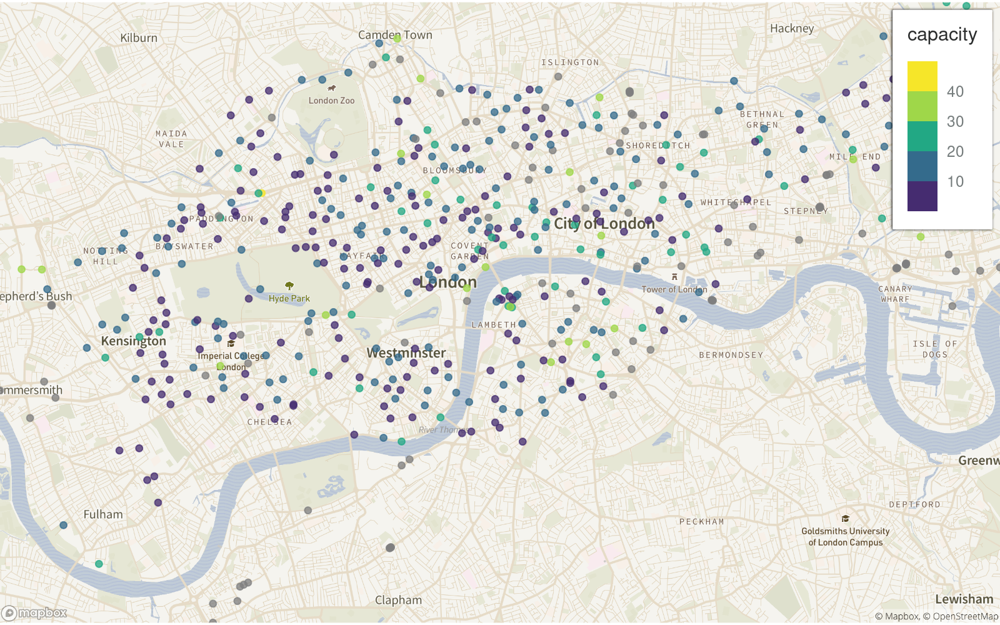

<!-- README.md is generated from README.Rmd. Please edit that file -->

# inlegend

<!-- badges: start -->

<!-- badges: end -->

`ggplot2` theming helpers for making static maps with inset legends:

  - `inset_legend_dark()`
  - `inset_legend_light()`
  - `theme_cropped_map()`

## Installation

From [GitHub](https://github.com/) with:

``` r
# install.packages("devtools")
devtools::install_github("milesmcbain/inlegend")
```

## Example

``` r
library(spData)
#> To access larger datasets in this package, install the spDataLarge
#> package with: `install.packages('spDataLarge',
#> repos='https://nowosad.github.io/drat/', type='source')`
library(snapbox) ##remotes::install_github("anthonynorth/snapbox")
library(ggplot2)
library(ggspatial)
library(sf)
#> Linking to GEOS 3.8.0, GDAL 3.0.4, PROJ 6.3.1
library(inlegend)
library(stylebox)
ggplot() +
  layer_mapbox(
    spData::cycle_hire_osm,
    stylebox::mapbox_gallery_frank()
  ) +
  layer_spatial(spData::cycle_hire_osm,
                aes(colour = capacity),
                alpha = 0.75) +
  scale_colour_viridis_b() +
  inset_legend_light("top-right") +
  theme_cropped_map()
#> Warning in showSRID(uprojargs, format = "PROJ", multiline = "NO", prefer_proj
#> = prefer_proj): Discarded ellps WGS 84 in CRS definition: +proj=merc +a=6378137
#> +b=6378137 +lat_ts=0 +lon_0=0 +x_0=0 +y_0=0 +k=1 +units=m +nadgrids=@null
#> +wktext +no_defs +type=crs
#> Warning in showSRID(uprojargs, format = "PROJ", multiline = "NO", prefer_proj =
#> prefer_proj): Discarded datum World Geodetic System 1984 in CRS definition
#> Warning in showSRID(uprojargs, format = "PROJ", multiline = "NO", prefer_proj
#> = prefer_proj): Discarded ellps WGS 84 in CRS definition: +proj=merc +a=6378137
#> +b=6378137 +lat_ts=0 +lon_0=0 +x_0=0 +y_0=0 +k=1 +units=m +nadgrids=@null
#> +wktext +no_defs +type=crs
#> Warning in showSRID(uprojargs, format = "PROJ", multiline = "NO", prefer_proj =
#> prefer_proj): Discarded datum World Geodetic System 1984 in CRS definition
```

<div class="figure">



<p class="caption">

Bike share capacity, London. Via {spData}

</p>

</div>
